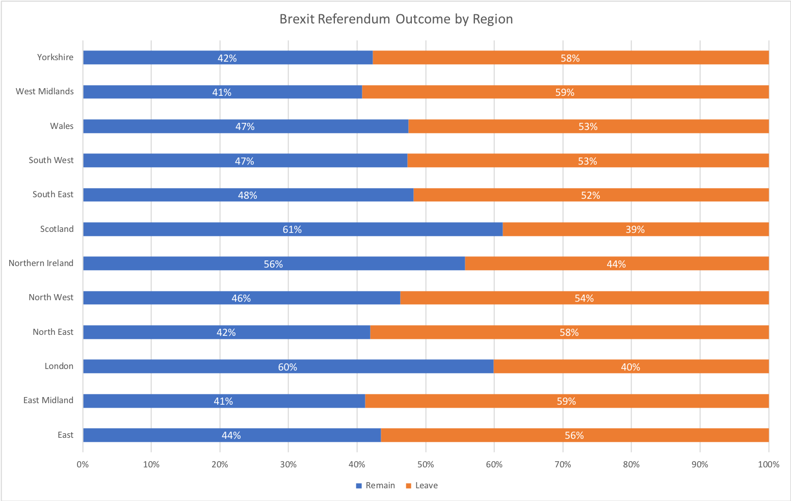

\newpage

# Einführung

# Methodologie

## Daten

## Indikatoren

# Ergebnisse

# Deep Dive: Regionale Unterschiede und Brexit

An dieser Stelle wollen wir uns intensiver der Fragestellung inwieweit Ungleichheitsmaße
mit dem Brexit in Verbindung gebracht werden können. Ausgangspunkt dieser Fragestellung ist
die vielfach g
Dazu wollen wir uns anschauen inwieweit regionale Unterschiede in den Abstimmungen
sich auch in unterschiedlichen Graden der Ungleichheit niederschlagen. Hierzu soll auf die 
12 Regionen eingegangen werden die der EU-Silc Datensatz unter DB040 auflistet. Diese
Aufteilung ist die selbe die auch die Electoral Commission in UK vornimmt. Figure 2 zeigt
die Abstimmungsergebnisse des EU Referendums für die einzelnen Regionen, prozentual nach Leave
und Remain. 
Die Regionenaufteilung im EU-Silc Datensatz ist dabei erst ab 2010 verfügbar. Für die
Jahre 2010 und 2011 werden die 12 Regionen noch weiter unterteilt in ingesammt 37 Sub-Regionen.

{width=80%}

Weiterer Ansatzpunkt ist der Vergleich der Wahlergebnisse verschiedener Altersgruppen und deren
Einkommen. Die Einteilung wurde beispielweise von BBC vorgenommen (Figure 3). Der Trend hier
ist eindeutig, ältere Bevölkerungsschichten haben eher für einen Austritt aus der EU gestimmt

# Zusammenfassung

# Literatur

<!-- Leer lassen -->