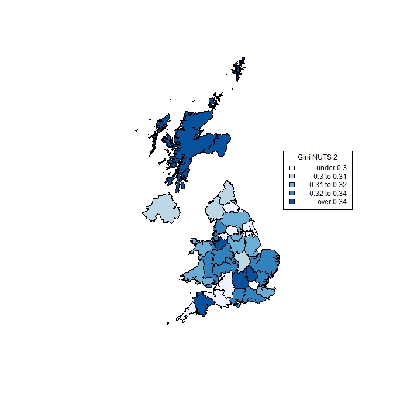
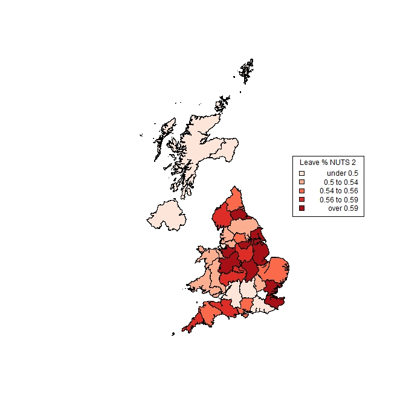

---
title: "Einkommensverteilung in Großbritannien"
author: "David Kamschal und Lino Kungl"
date: '`r format(Sys.time(), "%d %B, %Y")`'
output:
  word_document:
    toc: yes
  pdf_document:
    highlight: tango
    includes:
      in_header: header.tex
    number_sections: yes
    toc: yes
  html_document:
    df_print: paged
    toc: yes
keywords: a, b, c
subtitle: 2063 - Ökonomie der Verteilung
bibliography: references.bib
---  
\pagenumbering{gobble}
\newpage
\pagenumbering{arabic}

# Einführung
Fragen der Einkommensverteilung und Einkommensungleichheit sind, nachdem sie bereits im wissenschaftlichen Diskurs
immer intensiver behandelt wurden, nun auch verstärkt in der öffentlichen Wahrnehmung präsent. Die Art des Diskurses geht dabei über normativ-ethische Erwägungen bezüglich Gerechtigkeit und Fairness hinaus und beinhaltet  differenzierte Analysen zu den ökonomischen Auswirkungen von Ungleichheit zum Beispiel auf das Wirtschaftswachstum (i.a. @kuznets1955, @Barro2000) oder den gesellschaftspolitischen Auswirkungen von Ungleichheit (i.a. @Piketty2014). In diesem Kontext nennt auch der Internationale Währungsfonds in seinem aktuellen Jahresbericht [@IWF2018] die Beseitigung von Ungleichheit als eine der wichtigsten Herausforderungen für die Zukunft. Grundlage für die Diskussion über Einkommensungleichheit ist die statistische Analyse der tatsächlichen Situation. Diese Arbeit widmet sich dieser Analyse anhand des Beispiels Großbritannien.

Großbritannien weist insbesondere seit den späten 70er bzw. frühen 80er-Jahren eine Vergrößerung der Einkommensungleichheiten auf. GB zog hierbei auch anderen hochentwickelten Ländern davon, wobei der Anstieg der Ungleichheit nur noch von jenem in den USA übertroffen wurde [@machin1996wage]. In Anbetracht der Tatsache, dass die Thatcher-Regierung zusammen mit der US-amerikanischen Reagan-Regierung damals die Speerspitze der neoliberalen Bewegung bildete, unter deren Ägide vor allem Steuersenkungen für Reiche und Unternehmen durchgesetzt wurden (mutmaßlich in der fehlgeleiteten Annahme, durch höheres Wachstum und sinkenden Steuerwiderstand zusätzliches Steuereinkommen zu generieren), ist dies wohl nicht weiter verwunderlich [@atkinson2005top, S. 338].

Zusätzlich zu dieser historischen Tatsache, hat Großbritannien auch aus anderen Gründen innerhalb der EU eine Sonderstellung inne. Zumindest bis zum Brexit-Votum spielte die Finanzindustrie im Vereinigten Königreich eine vergleichsweise bedeutende Rolle als Quelle der Wertschöpfung. Der freie Zugang zum europäischen Festland, die englische Sprache und nicht zuletzt kulturelle Gründe hatten England als europäischen "Außenposten" amerikanischer und auch internationaler Finanzkonzerne etabliert. Diese Entwicklung hatte für Großbritanniens Bürgerinnen und Bürger allerdings nicht nur positive Auswirkungen: Die hohen und stark ansteigenden Spitzenverdienste in der Finanzbranche besonders in den Jahren vor der Krise führten zu einem vergleichsweise stärkeren Anstieg der Einkommensungleichheit, als dies in anderen europäischen Ländern zu beobachten war [@Bell2010]. Das legt im weiteren Sinn auch ein Bericht des IWF nahe [@jaumotte2013], wonach sich zwar nicht so sehr die Globalisierung selbst, dafür aber der finanzielle Aspekt der Globalisierung im Speziellen auf die Einkommensverteilung auswirkt und zum Phänomen einer höheren Ungleichheit führt. Auch Technologie wird dabei als Faktor genannt, da der Einsatz von Technologie auch den Bedarf an höher qualifiziertem Personal verstärkt und dadurch deren Einkommen relativ zu den Löhnen niedrig qualifizierten Personals ansteigen lässt. 

Der wachsende Fokus der Wirtschaft des Vereinigten Köngreichs auf Finanzdienstleistungen machte wiederum die britische Wirtschaft gegenüber Krisen auf den internationalen Finanzmärkten besonders verwundbar. Wie man im weiteren Verlauf dieser Arbeit noch sehen wird, hat die Finanzkrise gemäß den Erwartungen zuerst zu einem Rückgang und dann zu einer nur langsamen Erholung der Durchschnittseinkommen britischer Haushalte geführt. Da Durchschnittswerte besonders stark auf Ausreißer (ergo: Bestverdiener) reagieren, die in der Finanzindustrie zu finden sein dürften, ist dieser starke Rückgang womöglich ein direktes Resultat von Pleiten und Entlassungen im Finanzsektor. Allerdings handelt es sich hierbei um Mutmaßungen. 

#Aufbau
Im Laufe dieser Arbeit widmen wir uns ausführlich dem Thema der Einkommensverteilung im Vereinigten Königreich. Wir führen nicht nur die Errechnung, Visualisierung und Interpretation verschiedener Verteilungsmaße durch, sondern behandeln darüber hinaus auch den Brexit als ein zusätzliches Thema. Prinzipiell ist diese Arbeit daher in 2 Teile geteilt: Im ersteren betrachten wir die auf Landesebene aggregierte Einkommensverteilung von Haushalten in Großbritannien. Wir beantworten die grundsätzliche Frage, inwiefern sich die Einkommen (aufgespaltet in verschiedene Komponenten) im Zeitverlauf geändert haben.

Im zweiten Teil behandeln wir den Brexit als Sonderthema. Wir konzentrieren uns allerdings nicht auf die Auswirkungen des Brexits, sondern viel eher auf die These, dass die Entwicklung der regionalen Einkommensverteilung mit dem Ausgang des Brexit-Votums in unmittelbarem Zusammenhang stand. Lassen sich Anhaltspunkte und Zahlen finden, die diese Verbindung bestätigen? Wenn das nicht der Fall ist, gibt es eventuell andere (womöglich überraschende) Erkenntnisse? Welche Regionen Großbritanniens haben maßgeblich für oder gegen den Brexit gestimmt, und was sind die regionalen Kennzahlen zur Einkommensverteilung?

# Methodologie

## Daten
Der von uns verwendete Datensatz umfasst EU-SILC-Daten der Jahre 2005 bis 2016. Der Datensatz für 2017 ist zum Zeitpunkt dieser Arbeit für Großbritannien noch nicht verfügbar. Aufgrund des Aufbaus von EU-SILC enthält er Informationen sowohl über Familien als auch über Einzelpersonen. Auf die Probleme der EU-SILC Daten in der Erfassung hoher Einkommen soll in dieser Arbeit nicht im Detail eingegangen werden [siehe bspw. @atkinson2005top S. 326].

## Indikatoren
Zu den von uns errechneten Indikatoren gehören (über die Jahre hinweg) das Durchschnittseinkommen (Mean), das Medianeinkommen (Med), der Gini-Koeffizient, P80/20 und der Top 10% Income Share. Die Indikatoren sind hierbei auf Haushaltsebene berechnet. Die Aggregation auf Haushaltsebene wird mit zwei verschiedenen Methoden unternommen: Die erste (als P1 gekennzeichnet) richtet sich nach der Methode von Eurostat und verteilt die Summe aller Einkommen eines Haushalts entsprechend eines Äquivalenzfaktors auf alle Personen dieses Haushaltes. Betrachtet man hierbei nur die verfügbaren Einkommen spricht man auch von den "verfügbaren Äquivalenzeinkommen". 

Die zweite Methode (P2) richtet sich nach der *World Inequality Database* und betrachtet nur Personen die 20 Jahre oder älter sind. Die Einkommen werden hier nicht nach dem Äquivalenzfaktor, der quasi Skaleneffekte großer Haushalte berücksichtigt, auf die Personen umgerechnet, sondern nach gleichen Teilen durch die Anzahl der Haushaltsmitglieder dividiert. Wie man bei den Ergebnissen sieht führt diese Art der Berechnung zu einer tendenziell ungleicheren Verteilung. Dies veranschaulicht die Notwendigkeit bei der Interpretation der Ergebnisse auch die Berechnungsmethode im Kopf zu haben.  


# Ergebnisse


- **Haushalte**

```{r echo=FALSE, }
# Read CSV data, "../../" to look two levels upwards
table <- read.csv("tables/mean.tot.csv")
knitr::kable(table, caption = "Mean P1 & P2 Households",format.args = list(big.mark = "'"))
```

```{r echo=FALSE, }
# Read CSV data, "../../" to look two levels upwards
table <- read.csv("tables/med.tot.csv")
knitr::kable(table, caption = "Median P1 & P2 Households",format.args = list(big.mark = "'"))
```

Im Vorfeld der Krise entwickelten sich sowohl Durchschnitts- als auch Medianeinkommen überdurchschnittlich stark. So wuchs etwa das durchschnittliche verfügbare Haushaltseinkommen im Jahr 2007 um ca. 10% (P1) bzw. 11% (P2) gegenüber dem des Vorjahres. Ebenfalls auffällig, aber nicht überraschend, ist der Rückfall des verfügbaren Einkommens im Jahr 2009 um ca. 22% (P1,P2) gegenüber dem Niveau von 2007 und ca. 14% (P1) bzw. 13% (P2) gegenüber 2006. Mit 2009 erreichten die Einkommen ihren definitiven Tiefpunkt und begannen in weiterer Folge, sich langsam aber unstetig zu erholen. Die Auswirkungen der Krise waren auch in den folgenden Jahren deutlich spürbar, denn die durchschnittlichen verfügbaren Haushaltseinkommen erreichten erst 2014 wieder das nominale Niveau von 2006, was einen ersten Schritt in Richtung Normalisierung und Überwindung der Krise andeutet. 2013 hatte es immerhin wieder einen vermutlich mit der Rezession im Euro-Raum zusammenhängenden Einbruch von 3% (P1) bzw. 5% (P2) der Durchschnittseinkommen gegeben. Dies verdeutlicht die starke Verflechtung der Wirtschaft des Vereinigten Königreichs mit der Europas trotz der Tatsache, dass Großbritannien nicht zum Euroraum gehört.

Bei den Medianeinkommen der Haushalte zeichnet sich ein differenziertes Bild zu den durchschnittlichen Haushaltseinkommen: Sie legten im Vergleich überdurchschnittlich zu. Die Median-Faktoreinkommen wuchsen von 2005 bis 2007 um ca. 19% (P1) bzw. 23% (P2), die Durschnitts-Faktoreinkommen wuchsen im selben Zeitraum hingegen um nur 11% (P1) bzw. 12% (P2). Und auch bei den verfügbaren Einkommen zeigt sich die selbe Tendenz aus stark zunehmenden Medianeinkommen (16% bzw. 19%) und deutlich schwächer steigenden Durschnittseinkommen (11% bzw. 12%). Vergleicht man Median und Durchschnittseinkommen, so fällt eine Rechtsschiefe der Einkommensverteilung auf, da der Median niedriger ist als der Mittelwert. Dies deutet bereits auf eine ungleiche Verteilung hin. Die Schiefe ist bei den Faktoreinkommen am höchsten, da auch die Differenz zwischen Median und Mittelwert dort am größten ist und nimmt zum verfügbaren Einkommen hin ab. Umverteilungmaßnahmen sowie progressive Steuersätze scheinen also erwartungsgemäß zu einer gleicheren Verteilung zu führen.

Im Rückblick offenbart die Entwicklung der Einkommen vor 2008, insbesondere das rasante Wachstum im Jahr 2007, alle Anzeichen einer Überhitzung der Wirtschaft, die von Konsum, Spekulation und Verschuldung getrieben wurde. Ab 2008, mit dem Beginn des Krachs an den Börsen, zeigten sich in allen Kategorien von Haushaltseinkommen deutliche Zeichen einer Abschwächung. Erst mit dem Jahr 2014 konnte dank der allmählichen Entspannung der Situation in Europa der kurzfristige Einbruch von 2013 vollständig kompensiert und überwunden werden. Doch bereits 2016 zeigen sich, möglicherweise in Folge des Brexit-Schocks in der britischen und europäischen Wirtschaft, wieder Anzeichen einer Stagnation der verfügbaren Haushaltseinkommen.

```{r echo=FALSE, }
# Read CSV data, "../../" to look two levels upwards
table <- read.csv("tables/gini.tot.csv")
knitr::kable(table, caption = "Gini for P1 & P2 Households")
```

Der Gini-Koeffizient der verfügbaren Haushaltseinkommen liefert ein interessantes Bild: Infolge der Krise kam es zu einer leichten Verringerung der Ungleichheit. Das unterstützt die These, dass der in GB besonders wichtige Finanzsektor stark unter der Krise gelitten hat. Dies lässt sich auch an der Veränderung des Medianeinkommens festmachen. So ist nach der Finanzkrise das Medianeinkommen der Top 15 Prozent stärker gesunken (ca. 1% p.a.) als das der gesamten Bevölkerung (0,6% p.a.), was zu einer gleicheren Verteilung, damit einem niedrigerem Gini-Koeffizienten c.p. führt [@cribb2018, S. 32]. 

Im europäischen Vergleich ist die Einkommensungleichheit gemessen am Gini eher hoch. Großbritannien liegt hier über dem EU-28 Durchschnitt des Gini sowie auch höher als beispielsweise Frankreich oder Deutschland [^2]. @darvas2016 erklären diesen Unterschied über die relativ geringe soziale Mobilität in Großbritannien. Diese geht Hand in Hand mit einer hohen "intergenerational earnings elasticity" [@darvas2016 S. 18] in Großbritannien. Das bedeutet, dass in Großbritannien das Einkommen stark mit dem Einkommen der Eltern korreliert ist. Soziale Mobilität und Einkommensungleichheit können sich zudem gegenseitig verstärken [@OECD2011], was es umso wichtiger für Großbritannien macht hier politische Reformen anzusetzen. 

[^2]: Für den europäischen Vergleich der Kennzahlen siehe https://ec.europa.eu/eurostat/data/database


```{r echo=FALSE, }
# Read CSV data, "../../" to look two levels upwards
table <- read.csv("tables/quint.tot.csv")
knitr::kable(table, caption = "80/20 P1 & P2 Households")
```

Der 80/20-Koeffizient für Haushalte zeigt, dass die Unterschiede im verfügbaren Einkommen tendenziell abgenommen haben. Noch deutlicher wird das im Bezug auf die Faktoreinkommen, bei denen sich der Koeffizient seit 2005 beinahe halbiert hat. Es gilt anzumerken, dass der 80/20 Koeffizient für das factor income nicht definiert ist, da das zwanzigste Perzentil Null ist und dadurch das Verhältnis mathematisch nicht berechnet werden kann. Dies liegt an negativen Einkommen, beispielsweise von Unternehmern, hauptsächlich jedoch an den fehlenden Arbeitseinkommen von Rentnern.

```{r echo=FALSE, }
# Read CSV data, "../../" to look two levels upwards
table <- read.csv("tables/top10.p1p2.csv")
knitr::kable(table, caption = "Anteil der Top 10% P1 & P2 Households")
```

Der Anteil der Top 10% der am besten verdienenden Haushalte im Vereinigten Königreich machte zwischen 2005 und 2016 etwa 54% bis 58% der verfügbaren Einkommen aus. Das sind selbstverständlich extrem hohe Werte die eindrucksvoll die eingangs erwähnte Tendenz stark wachsender Spitzenverdienste im Vergleich zu eher stagnierenden mittleren und niedrigeren Einkommen unterstreichen. Ebenfalls konsistent mit unseren Annahmen sanken diese Anteile ab 2009 um 1 bis 2 Prozentpunkte und erreichten ab 2013/2014 wieder ihre Werte von vor der Krise.

# Deep Dive: Regionale Unterschiede und Brexit

{width=100%}

An dieser Stelle wollen wir uns intensiver der Fragestellung widmen, inwieweit Ungleichheitsmaße
mit dem Brexit in Verbindung gebracht werden können. Dazu wollen wir uns ansehen, ob sich regionale Unterschiede in den Abstimmungsergebnissen auch in unterschiedlichen Graden der Ungleichheit niederschlagen. Hierzu soll auf die 
12 Regionen eingegangen werden, die der EU-Silc Datensatz unter DB040 auflistet, die sogenannten NUTS 1 Regionen [^1]. Diese Aufteilung ist die selbe, die auch die Electoral Commission in Großbritannien vornimmt. Die Regionenaufteilung im EU-Silc Datensatz ist dabei erst ab 2010 verfügbar. Für die
Jahre 2010 und 2011 werden die 12 Regionen noch weiter unterteilt in ingesammt 37 Sub-Regionen. Es gab diesbezüglich bereits empirische Arbeiten, die sozioökonomische Variablen mit den Ergebnissen des Referendums in den verschiedenen Regionen in Verbindung brachten. 
@Arnorsson2016brexit konnten zeigen, dass eine Ablehnung gegenüber der EU, welche sich in einem "leave" Votum manifestierte, besonders in Regionen mit niedrigem BIP/Kopf, hohem Anteil an Personem mit niedrigem Bildungsgrad sowie einem hohem Anteil an
Personen über 65 auftritt. Die in dieser Arbeit verwendeten Einkommensmaße spiegeln dabei analoge Phänomene wider. Ein niedriges Drchschnittseinkommen bzw. ein niedriges Medianeinkommen ist mit einem niedrigen BIP/Kopf vergleichbar, sowie mit einem niedrigem durchschnittlichen Bildungsgrad. Hier würden wir ähnliche Ergebnisse in unseren Daten erwarten. Inwieweit auch die direkten Ungleichheitsmaße wie der Gini-Koeffizient oder das Verhältnis der einkommensstärksten 10 Prozent am Gesamteinkommen eine Korrelation mit dem Wahlergebnis der verschiedenen Regionen aufweist, eröffnet einen zusätzlichen Blickwinkel für die Thematik. Figure 3 zeigt zunächst die Abstimmungsergebnisse des EU Referendums für die einzelnen Regionen, prozentual nach Leave und Remain.

[^1]: See <https://www.arcgis.com/sharing/rest/content/items/32fdbc48cd8d46e89fabddd58b353c6c/data> for a map of the NUTS Regions

{width=100%}


```{r echo=FALSE, }
# Read CSV data, "../../" to look two levels upwards
table <- read.csv("tables/gini.regions.csv")
knitr::kable(table, caption = "Gini by Region")
```

In dieser Übersicht ist eine Tendenz zu erkennen, dass in Regionen in denen die Ungleichheit
eher zurückging, vermehrt gegen den Brexit gestimmt wurde. Namentlich sind das London,
Nordirland und Schottland. In Yorkshire, North East und East Midland ist die Ungleichheit gemessen
am Gini hingegen eher angestiegen. Ein Anstieg der Ungleichheit könnte ein Indiz für soziale Faktoren
sein, die eine Pro-Brexit Einstellung in der Bevölkerung begünstigen. Gewisse Existenzängste und
der Argwohn gegenüber Neuem könnten im Hinblick auf die Migration, die man mit dem Brexit unter 
"Kontrolle" bringen wollte, eine Rolle gespielt haben. Selbstverständlich handelt es sich hierbei um
eine erste Impression der nachfolgend noch genauer nachgegangen werden soll. Dadurch soll die Stichhaltigkeit 
der These überprüft werden, dass Phänomene der Einkommenssituation und -verteilung einen Einfluss auf das Ergebnis der Brexitreferendums hatten.

```{r echo=FALSE, }
# Read CSV data, "../../" to look two levels upwards
table <- read.csv("tables/mean.regions.csv")
knitr::kable(table, caption = "Mean Income by Region", format.args = list(big.mark = "'"))
```

Auch im Durschnittseinkommen sieht man, dass in Schottland und Nordirland die Einkommen
besonders stark gestiegen sind und in London generell hoch sind. In Tabelle 8 wurden die Effekte in separaten Regressionen geschätzt. Zum einen die Veränderung des Gini sowie der Gini-Koeffizient im Jahr 2016 wie in Tabelle 6 angegeben. Darüberhinaus die absolute Veränderung des Durschnittseinkommens sowie die Höhe des Durschnittseinkommens im Jahr 2016 wie in Tabelle 7 angegeben. 

```{r setup, include=FALSE}

knitr::opts_chunk$set(echo = TRUE, message=FALSE, warning=FALSE)

library(stargazer)
```

```{r echo=FALSE, }
table <- read.csv("tables/reg.regions.csv")
```


```{r, results='asis', echo=FALSE}
stargazer(lm(Leave ~ Percent.Change.Gini , subset(table, Leave > 0)), lm(Leave ~ Delta.Mean, subset(table, Leave > 0)), lm(Leave ~ mean16, subset(table, Leave > 0)), lm(Leave ~ gini16, subset(table, Leave > 0)),header=FALSE, omit.stat=c("LL","ser","f"), title="Resultate Regionen")
```


Es ergeben sich für keine der Größen statistisch signifikante Effekte (bei der Veränderung des Gini-Koeffizienten nur auf dem 10% Niveau). Dies hängt höchstwahrscheinlich aber mit der Größe des Samples zusammen, das nicht genügend Beobachtungen für statistisch signifikante Koeffizienten bietet. Hierauf deutet auch der teils negative adjusted R-squared hin. Daher wollen wir im Folgenden noch auf das Jahr 2011 eingehen. Für dieses Jahr gibt es im EU.Silc Datensatz eine feingliedrige Aufteilung der Regionen auf NUTS 2 Ebene. Zwar liegen diese Beobachtungen zeitlich weiter zurück, jedoch können die Zusammenhänge durch die Vergrößerung des Samples präziser geschätzt werden.
@Arnorsson2016brexit verwenden ebenfalls die Unterteilung auf NUTS 2 Ebene und erhalten dadurch auch statistisch signifikante Werte in ihren Regression. So stellen sie fest, dass es einen großen Anteil an Befürwortern des Brexit besonders in den Regionen gab, die im 19. und 20. Jahrhundert große Industriestandorte waren und in den letzten Jahrzehnten
im Zuge der Globalisierung eher einen Schwund ihrer Wirtschaftskraft verbüßen mussten. Dazu zählen die Autoren beispielsweise die Regionen "East Yorkshire and Northern Lincolnshire" und "South Yorkshire", die mit knapp 65 respektive 61,5 Prozent für den Brexit stimmten und die ehemals das Zentrum der Kohle- und Stahlindustrie waren, seitdem aber einen wirtschaftlichen Abschwung erlebten. Im Gegensatz dazu stehen London und die südöstlichen Regionen "Berkshire, Buckinghamshire and Oxfordshire" und "Surrey, East and West Sussex", die wirtschaftliche Gewinner der letzten Dekaden waren und allesamt gegen den Brexit gestimmt haben. Aus diesem Grund sollen auch die Durchschnittseinkommen untersucht werden und als Proxy für die generelle Entwicklung der Wirtschaft in den Regionen dienen. 


Im folgenden sieht man die Wahlergebnisse des Referendums auf NUTS 2 Ebene, sowie die dazugehörigen Einkommen: 

```{r echo=FALSE, }
table <- read.csv("tables/nuts2.csv")
knitr::kable(table, caption = "NUTS 2 Regions",format.args = list(big.mark = "'"))
```


{width=100%}

Im Anschluss finden sich die Ergebnisse der Regressionen. Diese wurden immer mit den Kennzahlen auf Basis des verfügbaren Einkommens (disposable incomes) durchgeführt. In einer ersten Regression wird der Effekt des Gini-Koeffizienten, des Medianeinkommens sowie des Durchschnittseinkommens jeweils separat und für das Jahr 2011 geschätzt (Tabelle 10). 

```{r echo=FALSE, }
table <- read.csv("tables/nuts.11.csv")
```


```{r, results='asis', echo=FALSE}
stargazer(lm(Leave ~ gini.reg, subset(table, Leave > 0)), lm(Leave ~ median.reg, subset(table, Leave > 0)),
          lm(Leave ~ mean.reg, subset(table, Leave > 0)),header=FALSE, title="Resultate NUTS 2 Regionen", covariate.labels=c("Gini", "Mean Income", "Gini*Mean"))
```


Wir finden zwei Regressionskoeffizienten die auf dem 5 Prozent Niveau signifikant sind: Der des Ginis sowie der des Durchschnitteinkommens. Für den Gini ist der Koeffizient negativ, was bedeuten würde dass eine Erhöhung der Ungleichheit gemessen am Gini negativ mit den "Leave" Votum korreliert. Das heißt, ungleichere Regionen waren eher für den Verbleib in der EU. Umgekehrt - und damit eher wie erwartet - verhält es sich beim Durchschnittseinkommen, in Regionen mit hohem Durchschnittseinkommen wurde demnach eher gegen den Brexit gestimmt. Der Koeffizient für das Durchschnittseinkommen besagt, dass bei einer Erhöhung der Durchschnittseinkommen um 1000, eine Verringerung des "Leave" Votums von einem Prozentpunkt zu erwarten wäre. Allerdings bleiben hier viele korrelierende Effekte unberücksichtigt. So ist beispielsweise zu erwarten, dass bei höheren Durchschnittseinkommen auch der durchschnittliche Bildungsgrad der entsprechenden Region höher ist. Daher wollen wir der Höhe des Koeffizienten hier wenig Aussagenkraft einräumen. In einem zweiten Regressionsmodell wollen wir nun mehr Variablen mit aufnehmen um für weitere Effekte kontrollieren zu können. Speziell das Vorzeichen des Gini-Koeffizienten scheint im Anbetracht anderer Literatur (z.B.@darvas2016) aber auch intuitiv fragwürdig. Da wir in dieser Analyse nicht die Auswirkung der Veränderung der Einkommen schätzen sondern nur einen Datenpunkt des jeweiligen Jahrs haben, könnten die schottischen Regionen und Nordirland die Ergebnisse verzerren. Diese haben zwar eine Steigerung der Einkommen erfahren gemessen am Median und Mittelwert, jedoch ist das generelle Niveau im regionalen Vergleich eher tief. Aus dieser Überlegung heraus verwenden auch @Arnorsson2016brexit Dummies für die Regionen um den Effekt zu isolieren. Zusätzlich begründen sie die Entscheidung Schottland und Nordirland getrennt zu den anderen Regionen zu betrachten damit, dass die Beweggründe gegen den Brexit zu stimmen generell anders gelagert waren. Ein wichtiger Faktor für Nordirland ist beispielsweise die Grenze mit Irland die historisch Konfliktpotenzial birgt und auch in den aktuellen Verhandlungen über den geregelten Ausstieg Großbritanniens aus der EU eine wichtige Rolle einnimmt [@Patten2018Ireland]. Gleichfalls wird ein Dummy für Inner London verwendet, da dieser Region in vielerlei Hinsicht eine spezielle Rolle zukommt. Des weiteren wird in dieser Schätzmethode ein Interaktionsterm zwischen Gini-Koeffizienten und Durchschnittseinkommen verwendet. Dieser soll kontrollieren ob eine ungleiche Einkommensverteilung bei unterschiedlichen Einkommensniveaus anders korreliert. Damit wird der Effekt starker Ungleichheit in einer Region relativiert wenn dort das durchschnittliche Einkommen hoch ist. @darvas2016 (S.84) führen eine ähnliche Regression durch, können aber mit ihrem Datensatz zwischen 173 Regionen unterscheiden, was innerhalb der EU-Silc Daten nicht möglich ist. Daher kontrollieren sie zusätzlich beispielsweise für Altergruppen, Bildungsgrad oder Arbeitslosenrate. In dieser Arbeit werden diese zusätzlichen Variablen -  auch aufgrund der fehlenden Freiheitsgrade im kleineren Sample - nicht vorgenommen. Die zwei Regressionen in Tabelle 11 sind wie folgt definiert:


$$(1)Leave.Share = \beta_0 + \beta_1 Gini + \beta_2 Mean + \beta_3 Gini*Mean + u$$
$$(2)Leave.Share = \beta_0 + \beta_1 Gini + \beta_2 Mean + \beta_3 Gini*Mean + Region.Dummies + u$$

Im ersten Schätzverfahren sind alle Variablen statistisch signifikant. Gini-Koeffizient und Durchschnittseinkommen haben dabei das umgekehrte Vorzeichen im Vergleich zu den einzelnen Regressionen in Tabelle 8. Des weiteren steigt der Erklärungsgehalt des Modells gemessen am adjusted R-squared auf 0,274 respektive 0,677. Kontrolliert man für die Regionen bleibt nur der Gini- Koeffizient und der Interkaktionsterm signifikant, allerding wieder nur auf dem 10 Prozent Niveau. Durch den Interaktionsterm ist die Höhe des Koeffizients für den Gini schwer zu interpretieren, wir halten jedoch fest, dass er positiv ist.  Damit ist das Ergebnis auch näher an @darvas2016 (S.84). Diese finden einen positiven Koeffizienten der Gini-Variable in allen Spezifikationen, was bedeutet, dass in Regionen mit höherer Ungleichheit  - ceteris paribus - eher für einen Brexit gestimmt wurde. Je nach Spezifikation ist der Effekt der Durschnittseinkommens positiv oder negativ mit dem "Leave"-Votum korreliert, was die Autoren mit einer starken Korrelation zum Bildungsgrad in Verbindung bringen. 
Für die Analyse in der vorliegenden Arbeit kann festgehalten werden, dass der EU-Silc Datensatz keine robusten Ergebnisse auf die Ausgangsfrage liefert. Als größtes Problem muss dabei die sehr grobe Regioneneinteilung gelten, die nur ein kleine Anzahl an Beobachtungen ermöglicht die wiederum nur ungenaue Ergebnisse liefern. Überraschend ist zudem, dass die regionale Gliederung im Datensatz ab 2011 noch grober wurde, anstatt eine feinere Aufteilung beispielsweise auf NUTS3 Level vorzunehmen. Die Information zur Region (db040) ist im Datensatz als "technical-item" beschrieben, der Verzicht auf eine feinere Gliederung erschließt sich dadurch auch beispielsweise nicht aus einer "Verschlankung" des Fragekatalogs an die einzelnen Personen. Vielmehr scheint eine feinere Regionenaufteilung eine recht einfache Ergänzung zu sein um den Informationsgehalt des Datensatzes zu steigern.


```{r echo=FALSE, }
table.11 <- read.csv("tables/nuts.11.csv")
```


```{r, results='asis', echo=FALSE}
stargazer(lm(Leave ~ gini.reg*mean.reg, subset(table.11, Leave > 0)),lm(Leave ~ gini.reg*mean.reg + Scotland + Northern.Ireland + London , subset(table.11, Leave > 0)),header=FALSE, title="Resultate NUTS 2 Regionen erweitert", covariate.labels=c("Gini", "Mean Income", "Scotland", "Northern Ireland", "Inner London", "Gini*Mean"))
```

## Räumliche Regression

Nach den regulären OLS-Schätzungen führten wir zusätzlich auch noch Schätzungen mit Methoden der räumlichen Ökonometrie durch. Die Datenbasis verblieb dabei dieselbe wie in NUTS-2, doch wurden aus Gründen einer Nicht-Übereinstimmung zwischen der NUTS-2-Einteilung von 2018 und den verfügbaren Daten die Regionen London, Schottland und die Region "Surry, East and West Sussex" exludiert. Damit verbleiben 33 Regionen. Die räumliche Regression beruht auf einem Spatial Error Model, d.h., es wird angenommen, dass die Fehlerterme aneinander angrenzender Regionen korreliert sind. Variablen die nicht im Model inkludiert sind, sich aber räumlich gegenseitig beeinflussen, können somit exkludiert und der Effekt der inkludierten Variablen besser isoliert werden. W gibt im Modell die räumliche Gewichtungsmatrix wieder, Lambda den räumlichen Fehlerparameter und Epsilon den Fehlerterm.

$$(3)Leave.Share = \beta_0 + \beta_1 Gini + (I_n - \lambda W)^{-1} \epsilon$$

Von Interesse war vor allem die Auswirkung des Gini-Koeffizienten auf das "Leave"-Votum (3). Berechnungen mit dem Spatial Error Model ergeben einen statistisch stark signifikanten (P = 0.012) Koeffizienten in Höhe von -0.49. Das bedeutet, dass eine Erhögung des Gini um einen Prozentpunkt zu einem erwarteten Absinken des Leave-Anteils um 0,49 Prozentpunkte führt. Dies ist insofern interessant, als die hierfür verwendete Datenbasis die Regionen London und Schottland exkludiert, die beide überdurchschnittlich stark für den Verbleib gestimmt hatten. 

$$(4)Leave.Share = \beta_0 + \beta_1 Mean + (I_n - \lambda W)^{-1} \epsilon$$

Die zweite räumliche Regression bezieht sich auf den Effekt des durchschnittlichen Einkommens auf das "Leave"-Votum. Hierbei ergeben sich ein Koeffizient von -8.3520e-06 und P-Wert von 0.054, nur knapp über dem 5%-Signifikanzniveau. Bezogen auf einen Anstieg der Durchschnittseinkommen von 1000 impliziert der Koeffizient somit eine Reduktion der "Leave"-Stimmen um 0.0083 (1 = 100%), also 0.83 Prozentpunkte.

Damit liefern auch die räumlichen Modelle Indizien dafür, dass sowohl höhere Ungleichheit als auch ein höhere Einkommen einen negativen Effekt auf den Stimmanteil für den Brexit hatten, wenn auch in (4) die Signifikanzgrenze knapp überschritten wurde.

# Zusammenfassung

Das Vereinigte Königreich lag in puncto Einkommensungleichheit schon vor der Krise im europäischen Spitzenfeld. Den vermeintlich größten Beitrag zu dieser Entwicklung leistete nach den Liberalisierungen der späten 70er bis 80er-Jahre unter Margaret Thatcher die britische Finanzindustrie, deren Spitzenverdiener besonders stark vom Wirtschaftsaufschwung der 2000er-Jahre profitiert hatten. Insbesondere die nicht-regulären Bonuszahlungen für Führungspersonal in Banken und Finanzfirmen sind in dieser Zeit regelrecht explodiert, wobei mitunter der Begriff der "Superstar"-Economy für das Phänomen geprägt wurde, dass sich unter höchst produktivem Personal die Unterschiede in der Entlohnung vergrößern, selbst wenn die Kluft in Qualifikation und Fähigkeit eigentlich gering ausfällt. Unabhängig von dieser Erklärung wurde gezeigt, u.A. von @Bell2010, dass die Finanzindustrie tatsächlich einen beträchtlichen Einfluss auf die Einkommensungleichheit im Vereinigten Königreich hat bzw. hatte.

Die Krise hat diese Entwicklung zumindest teilweise wieder rückgängig gemacht und dazu geführt, dass sich die Einkommensverteilung wieder etwas näher an das europäische Niveau angeglichen hat. Während es sich bei diesem Phänomen anscheinend um eine längerfristige Veränderung handelt, haben sich die Einkommen selbst seit der Krise wieder auf das Vorkrisenniveau erholt und es in weiterer Folge überschritten.  Allerdings muss dazu angemerkt werden, dass praktisch alle Einkommensschichten Verlierer der Krise waren. Sinkende Durchschnittseinkommen waren aufgrund der Einbußen von Bestverdienern zu erwarten, aber auch die Medianeinkommen haben unter der Krise gelitten, was den Schluss zulässt, dass auch die Mittelschicht deutliche Einbußen bei Einkommen und Kaufkraft hinnehmen musste. Insofern ist der Rückgang des Gini-Koeffizienten in Folge der Krise nicht unbedingt als positive Entwicklung zu werten - dies wäre eher der Fall gewesen, hätten die unteren Dezile der Einkommensverteilung Zuwächse zu verzeichnen gehabt. Dazu muss außerdem gesagt werden, dass die in Folge der Krise entgangenen Einkommenszuwächse beinahe das Ausmaß eines "verlorenen Jahrzehnts"" annehmen.

Dies mag auch mitunter einer der Gründe für das Brexit-Votum sein. Wir haben die Theorie aufgestellt, dass Einkommensungleichheit und die Neigung für den Brexit zu stimmen in Korrelation zu einander stehen könnten und haben dies auf regionaler Ebene geprüft. Wie zu erwarten haben gerade jene Regionen Großbritanniens gegen den Brexit gestimmt, die in Folge der europäischen Integration am meisten davon profitiert haben, nämlich London, Schottland und Nordirland. Analog dazu haben diese Regionen vom Verlust der EU-Mitgliedschaft auch relativ gesehen mehr zu verlieren. Sieht man von diesen Regionen ab, zeichnet sich jedoch ein relativ einheitliches, spiegelverkehrtes Bild: Die ländlichen und ehemaligen industriellen Gebiete des Vereinigten Königreichs, in denen in Folge der Globalisierung ein langfristiger wirtschaftlicher Abschwung und der dauerhafte Verlust von Arbeitsplätzen zu verzeichnen waren, haben erwartungsgemäß mit teils deutlicher Mehrheit für den Brexit gestimmt. Die Einkommensverteilung scheint dabei ein eher geringerer Faktor gewesen zu sein als etwa die Kenngrößen der Demographie: Regionen, in denen Menschen höheren Alters, niedrigerer Bildung und geringeren Einkommens einen höheren Anteil der Bevölkerung ausmachen, haben tendenziell für "Leave"" gestimmt. Folgt man der Argumentation von @Brewer2013, so zeigt sich überdies, dass gerade die schlechter verdienenden Bevölkerungsschichten von auch lang nach Ausbruch der Krise betroffen waren, in erster Linie aufgrund einer konservativer gewordenen Fiskalpolitik und steigenden Anteilen an Bezügen aus Sozialleistungen. Waren dies Auswirkungen der Krise also bis zum Brexit-Votum 2016 für untere Einkommensschichten besonders stark spürbar, so wäre der Ausgang des Brexit-Votums somit umso weniger verwunderlich.   

Im Endeffekt deuten viele Indizien darauf hin, dass nicht die Ungleichheit in den Regionen, sondern zwischen den Regionen den Ausschlag für das Votum gegeben hat. Die De-Industrialisierung des Landes hat bei den Betroffenen augenscheinlich Frust verursacht, der sich in politischem Unmut manifestierte, über den auch die durchwegs gute gesamtwirtschaftliche Performance Großbritanniens vor der Krise nicht hinwegtäuschen konnte.


\newpage
# Literatur

<!-- Leer lassen -->