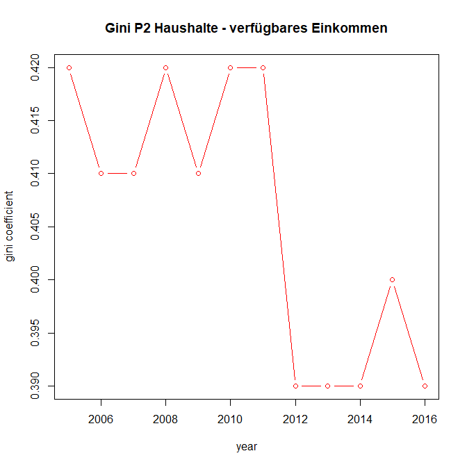

---
title: "Einkommensverteilung in Großbritannien"
author: "David Kamschal und Lino Kungl"
date:
output:
  pdf_document:
    includes:
      in_header: header.tex
    toc: yes
  html_document:
    df_print: paged
    toc: yes
keywords: a, b, c
bibliography: references.bib
subtitle: 2063 - Ökonomie der Verteilung
---  

\newpage

# Einführung
Großbritannien weist insbesondere seit den späten 70er bzw. frühen 80er-Jahren eine Vergrößerung der Einkommensungleichheiten auf. GB zog hierbei auch anderen hochentwickelten Ländern davon, wobei der Anstieg der Ungleichheit nur noch von jenem in den USA übertroffen wurde (Machin 1996). In Anbetracht der Tatsache, dass die Thatcher-Regierung zusammen mit der US-amerikanischen Reagan-Regierung damals die Speerspitze der neoliberalen Bewegung bildete, unter deren Ägide vor allem Steuersenkungen für Reiche und Unternehmen durchgesetzt wurden (mutmaßlich in der fehlgeleiteten Annahme, durch höheres Wachstum und sinkenden Steuerwiderstand zusätzliches Steuereinkommen zu generieren), ist dies wohl nicht weiter verwunderlich.

Zusätzlich zu dieser historischen Tatsache, hat Großbritannien auch aus anderen Gründen innerhalb der EU eine Sonderstellung inne. Zumindest bis zum Brexit-Votum spielte die Finanzindustrie in GB eine vergleichsweise bedeutende Rolle als Quelle der Wertschöpfung. Der freie Zugang zum europäischen Festland, die englische Sprache und nicht zuletzt kulturelle Gründe hatten England als europäischen "Außenposten" amerikanischer und auch internationaler Finanzkonzerne etabliert. Diese Entwicklung hatte für Großbritanniens Bürgerinnen und Bürger allerdings nicht nur positive Auswirkungen: Die hohen Spitzenverdienste in der Finanzbranche führten zu einem vergleichsweise stärkeren Anstieg der Einkommensungleichheit, und der Fokus auf Finanzdienstleistungen machte die britische Wirtschaft gegenüber Krisen auf dem Finanzmarkt besonders verwundbar. Wie man in späteren Kapitaln dieser Arbeit noch sehen wird, hat die Finanzkrise zuerst zu einem Rückgang und dann zu einer nur langsamen Erholung der Durchschnittseinkommen britischer Haushalte geführt. Da Durchschnittswerte besonders stark auf Ausreißer (ergo: Bestverdiener) reagieren, die in der Finanzindustrie zu finden sein dürften, ist dieser starke Rückgang womöglich ein direktes Resultat von Pleiten und Entlassungen im Finanzsektor. Allerdings handelt es sich hierbei um Mutmaßungen. 

#Aufbau
Im Laufe dieser Arbeit widmen wir uns nicht nur der Errechnung, Visualisierung und Interpretation verschiedener Verteilungsmaße, sondern
behandeln darüber hinaus auch den Brexit als Thema. Stehen Brexit und eine Veränderung der Einkommensungleichheit miteinander in Verbindung? Welche Regionen Großbritanniens haben maßgeblich für oder gegen den Brexit gestimmt, und was sind die regionalen Kennzahlen zur Einkommensverteilung?


# Methodologie


## Daten
Der von uns verwendete Datensatz umfasst EU-SILC-Daten von 2005 bis 2017. Aufgrund des Aufbaus von EU-SILC enthält er
Informationen sowohl über Familien als auch über Einzelpersonen.

## Indikatoren
Zu den von uns errechneten Indikatoren gehören (über die Jahre hinweg) das Durchschnittseinkommen (Mean), das Medianeinkommen (Med), der Gini-Koeffizient, P80/20 und den Top 10% Income Share. Wir errechnen alle Indikatoren sowohl für Personen als auch für Haushalte.


# Ergebnisse


- **Haushalte**

```{r echo=FALSE, }
# Read CSV data, "../../" to look two levels upwards
table <- read.csv("tables/mean.tot.p2.csv")
knitr::kable(table, caption = "mean P2 Households")
```

Das durchschnittliche verfügbare Haushaltseinkommen wuchs bis 2007 an, im Jahr 2007 sogar besonders stark. Bemerkenswert ist der Rückfall des verfügbaren Einkommens im Jahr 2009 um ca. 22% gegenüber dem Niveau von 2007 bzw. 13% gegenüber 2006. Die Auswirkungen der Krise waren auch in den folgenden Jahren deutlich spürbar, denn die verfügbaren Haushaltseinkommen erreichten erst 2012 wieder das nominale Niveau von 2006. Erst ab 2014 schien die Krise vollständig überwunden zu sein.   

Plot

```{r echo=FALSE, }
# Read CSV data, "../../" to look two levels upwards
table <- read.csv("tables/med.tot.p2.csv")
knitr::kable(table, caption = "median P2 Households")
```

Bei den Medianeinkommen der Haushalte zeichnet sich ein ähnliches Bild wie bei den durchschnittlichen: Starker Anstieg bis 2007, erste Zeichen von Schwäche ab 2008 und daraufhin ein "Tal der Tränen", das erst ab 2012 bzw. 2014 vollständig durchquert wurde.

Plot


```{r echo=FALSE, }
# Read CSV data, "../../" to look two levels upwards
table <- read.csv("tables/gini.tot.p2.csv")
knitr::kable(table, caption = "gini P2 Households")
```

Der Gini-Koeffizient der verfügbaren Haushaltseinkommen liefert ein interessantes Bild: Infolge der Krise kam es zu einer leichten Verringerung der Ungleichheit. Das unterstützt die These, dass der in GB besonders wichtige Finanzsektor stark unter der Krise gelitten hat. Allerdings handelt es sich bei der Veränderung des Gini-Koeffizienten nur um eine geringe Bandbreite.

{height=50%, width=80%}

ist noch sehr rudimentär eingefügt
auch der Plot braucht noch Arbeit

```{r echo=FALSE, }
# Read CSV data, "../../" to look two levels upwards
table <- read.csv("tables/quint.tot.p2.csv")
knitr::kable(table, caption = "80/20 P2 Households")
```

Der 80/20-Koeffizient für Haushalte zeigt, dass die Unterschiede im verfügbaren Einkommen tendenziell abgenommen haben. Noch deutlicher wird das im Bezug auf die Faktoreinkommen, bei denen sich der Koeffizient seit 2005 beinahe halbiert hat. 
(möglicherweise Problem mit den Daten?)


Plot


# Deep Dive: Regionale Unterschiede und Brexit

An dieser Stelle wollen wir uns intensiver der Fragestellung inwieweit Ungleichheitsmaße
mit dem Brexit in Verbindung gebracht werden können. Dazu wollen wir uns anschauen inwieweit regionale Unterschiede in den Abstimmungen 
sich auch in unterschiedlichen Graden der Ungleichheit niederschlagen. Hierzu soll auf die 
12 Regionen eingegangen werden die der EU-Silc Datensatz unter DB040 auflistet. Diese
Aufteilung ist die selbe die auch die Electoral Commission in UK vornimmt.  
Die Regionenaufteilung im EU-Silc Datensatz ist dabei erst ab 2010 verfügbar. Für die
Jahre 2010 und 2011 werden die 12 Regionen noch weiter unterteilt in ingesammt 37 Sub-Regionen.
Es gab diesbezüglich bereits empirische Arbeiten die sozioökonomische Variablen mit den Ergebnissen
des Referendums in den verschiedenen Regionen in Verbindung brachten. Arnorsson und Zoega (2016) konnten 
zeigen, dass eine Ablehnung gegenüber der EU, welche sich in einem "leave" Votum manifestierte, besonders in 
Regionen mit niedrigem BIP per capita, hohem Anteil an Personem mit niedrigem Bildungsgrad, hohem Anteil an
Personen über 65 sowie einer starken Netto Immigration auftritt. Die in dieser Arbeit verwendeten Einkommensmaße
spiegeln dabei analoge Phänomene wieder. Ein niedriges Drchschnittseinkommen respektive ein niedriges Medianeinkommen ist mit einem niedrigen BIP per capita vergleichbar sowie einem niedrigem durchschnittlichen Bildungsgrad. Hier würden wir ähnliche Ergebnisse in unseren Daten erwarten. Inwieweit auch die direkten Ungleichheitsmaße wie der Gini-Koeffizient oder das Verhältnis der einkommensstärksten 10 Prozent am Gesamteinkommen eine Korrelation mit dem Wahlergebnis der verschiedenen Regionen aufweist eröffnet einen zusätzlichen Blickwinkel für die Thematik. Figure 3 zeigt zunächst
die Abstimmungsergebnisse des EU Referendums für die einzelnen Regionen, prozentual nach Leave
und Remain.
  

{width=100%}


```{r echo=FALSE, }
# Read CSV data, "../../" to look two levels upwards
table <- read.csv("tables/gini.regions.csv")
knitr::kable(table, caption = "Gini by Region")
```

In dieser Übersicht ist eine Tendenz zu erkennen, dass in Regionen in denen die Ungleichheit
eher zurück gegangen, vermehrt gegen den Brexit gestimmt wurde. Namentlich sind das London,
Nord Irland und Schottland. In Yorkshire, North East und East Midland ist die Ungleichheit gemessen
am Gini hingegen eher gestiegen. Eine gestiegen Ungleichheit könnte ein Indiz für soziale Faktoren
sein die eine Pro-Brexit Einstellung in der Bevölkerung begünstigen. Gewissen Existenzängste und
der Argwohn gegenüber Neuem können im Hinblick auf die Migration die man mit dem Brexit unter 
"Kontrolle" bringen wollte eine Rolle gespielt haben. Selbstverständlich handelt es sich hier um
eine erste Impression der im folgenden noch genauer nachgegangen werden soll. Dadurch soll die Stichhaltigkeit 
der These überprüft werden, dass Phänomene der Einkommenssituation und -verteilung einen Einfluss auf das Ergebnis der Brexitreferendums hatten.

```{r echo=FALSE, }
# Read CSV data, "../../" to look two levels upwards
table <- read.csv("tables/mean.regions.csv")
knitr::kable(table, caption = "Mean Income by Region")
```

Auch im Durschnittseinkommen sieht man, dass in Schottland und Nordirland die Einkommen
besonders stark gestiegen sind und in London generell hoch sind.
Arnorsson und Zoega (2016) stellen fest, dass es einen großen Anteil an Befürwortern des Brexit besonders 
in den Regionen gab die im 19. und 20. Jahrhundert große Industriestandorte waren und in den letzten Jahrzehnten
im Zuge der Globalisierung eher einen Schwund ihrer Wirtschaftskraft sahen. Darunter zählen die Autoren beispielsweise die Regionen "East Yorkshire and Northern Lincolnshire" und "South Yorkshire" die mit knapp 65 respektive 61,5 Prozent für den Brexit stimmten und die früher das Zentrum der Kohle- und Stahlindustrie waren, seitdem aber einen wirtschaftlichen Abschwung erlebten. Im Gegensatz dazu stehen London und die südöstlichen Regionen "Berkshire, Buckinghamshire and Oxfordshire" und "Surrey, East and West Sussex", die wirtschaftliche Gewinner der letzten Dekaden waren und allesamt gegen den Brexit gestimmt haben. Aus diesem Grund sollen auch die Veränderungen der Durchschnittseinkommen untersucht werden und als Proxy für die generelle Entwicklung der Wirtschaft in den Regionen dienen. 


Da wir für die Jahre 2010 und 2011 eine feingliedrige Aufteilung der Regionen auf NUTS 2 Ebene haben, wollen wir diese Jahre noch explizit ausleuchten. Zwar liegen diese Jahre weiter zurück, jedoch können die Zusammenhänge durch die Vergrößerung des Samples präzieser geschätz werden. Im folgenden sieht man die Wahlergebnisse des Referendum auf NUTS 2 Ebene: 

```{r echo=FALSE, }
table <- read.csv("tables/nuts2.csv")
knitr::kable(table, caption = "NUTS 2 Regions")
```

Im Anschluss die Ergebnisse 

# Zusammenfassung

\newpage

# Anhang


```{r echo=FALSE, }
# Read CSV data, "../../" to look two levels upwards
table <- read.csv("tables/mean.tot.p1.csv")
knitr::kable(table, caption = "Mean P1")
```


```{r echo=FALSE, }
# Read CSV data, "../../" to look two levels upwards
table <- read.csv("tables/med.tot.p1.csv")
knitr::kable(table, caption = "Median P1")
```


```{r echo=FALSE, }
# Read CSV data, "../../" to look two levels upwards
table <- read.csv("tables/gini.tot.p1.csv")
knitr::kable(table, caption = "Gini P1")
```

```{r echo=FALSE, }
# Read CSV data, "../../" to look two levels upwards
table <- read.csv("tables/quint.tot.p1.csv")
knitr::kable(table, caption = "80/20 P1")
```


```{r echo=FALSE, }
# Read CSV data, "../../" to look two levels upwards
table <- read.csv("tables/mean.tot.p2.csv")
knitr::kable(table, caption = "Mean P2")
```


```{r echo=FALSE, }
# Read CSV data, "../../" to look two levels upwards
table <- read.csv("tables/med.tot.p2.csv")
knitr::kable(table, caption = "Median P2")
```


```{r echo=FALSE, }
# Read CSV data, "../../" to look two levels upwards
table <- read.csv("tables/gini.tot.p2.csv")
knitr::kable(table, caption = "Gini P2")
```

```{r echo=FALSE, }
# Read CSV data, "../../" to look two levels upwards
table <- read.csv("tables/quint.tot.p2.csv")
knitr::kable(table, caption = "80/20 P2")
```


\newpage
# Literatur

<!-- Leer lassen -->